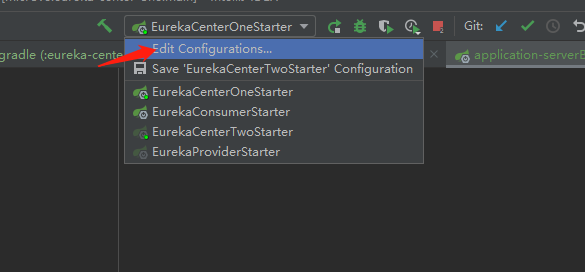
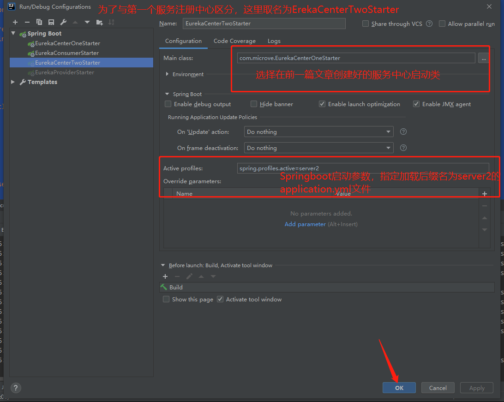
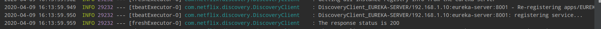

# Eureka从0到1完整实践(下) —— 基于Eureka实现高可用的服务治理方案

本项目全程使用Gradle完成构建，Gradle版本为5.4.1
## 前置条件

- 搭建基本的单点项目。[Eureka从0到1完整实践(上) —— 基于Eureka构建最简服务治理方案](https://slowside45.github.io/SpringCloud/eureka.html)

---


## 参考链接
- [究竟啥才是互联网架构“高可用”](https://mp.weixin.qq.com/s?__biz=MjM5ODYxMDA5OQ==&mid=2651959728&idx=1&sn=933227840ec8cdc35d3a33ae3fe97ec5&chksm=bd2d046c8a5a8d7a13551124af36bedf68f7a6e31f6f32828678d2adb108b86b7e08c678f22f&scene=21#wechat_redirect) —— @58沈剑

**本篇文章，将记录使用Eureka完成服务层面的高可用设计。**

---

## 什么是高可用？

> 高可用HA（High Availability）是分布式系统架构设计中必须考虑的因素之一，它通常是指，通过设计减少系统不能提供服务的时间。

常见系统，一般通过**冗余**+**自动故障转移**来实现系统的高可用特性。
- 冗余： 同时多个系统可以同步对外提供服务。
- 自动故障转移： 当一个系统出现故障时，流量能自动转移到正常运行的系统上。

---


## 服务注册中心集群部署

- 创建application-server2.yml文件

  


  ```
  server:
    port: 8001
  spring:
    application:
      name: eureka-server
    # Springboot应用启动参数
    profiles:
      active: server2
  eureka:
    instance:
      # 该服务的主机名称
      hostname: eureka-center2
      # 服务失效时间，Eureka多长时间没收到服务的心跳操作，就剔除该服务，默认90秒
      lease-expiration-duration-in-seconds: 90
      # 表示eureka client发送心跳给server端的频率
      lease-renewal-interval-in-seconds: 30
    client:
      # 表示是否注册，默认为true
      register-with-eureka: true
      # 表示是否拉取，默认为true
      fetch-registry: true
      # 该注册中心将会被注册到8000端口上的另一个eureka服务注册中心，它们之间的数据将会共享。
      service-url:
        defaultZone: http://localhost:8000/eureka/
    server:
      # eureka server清理无效节点的时间间隔，默认60000毫秒，即60秒
      eviction-interval-timer-in-ms: 60000
      # 自我保护模式（缺省为打开）
      enable-self-preservation: true
  ```

- 编辑应用启动选项






- 启动两个服务注册中心（不分先后）

  8000端口的服务注册中心1 已启动

  

  8001端口的服务注册中心2 已启动

  


期间，可能会出现这样的异常：


这是由于服务启动时，它需要将自身注册到application.yml文件中指定的serverUrl所在的服务注册中心上，这时服务注册中心可能尚未完成启动，就会抛出这样的异常。由于eureka会定期向服务注册中心发送请求，当服务注册中心启动成功后，你将看到如下提示：



这时，说明该服务已成功注册到服务中心。

按照以上步骤，我们在8000端口和8001端口已经启动了两个基于eureka实现的服务注册中心，eureka自动为我们构建了管理页面，访问http://localhost:8000和http://localhost:8001即可查看。

