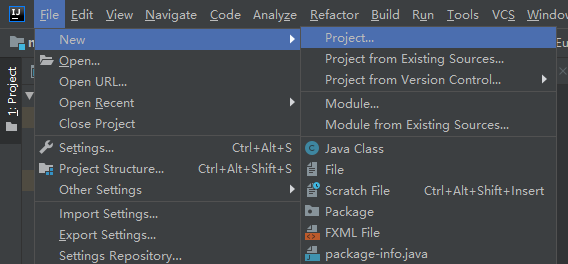
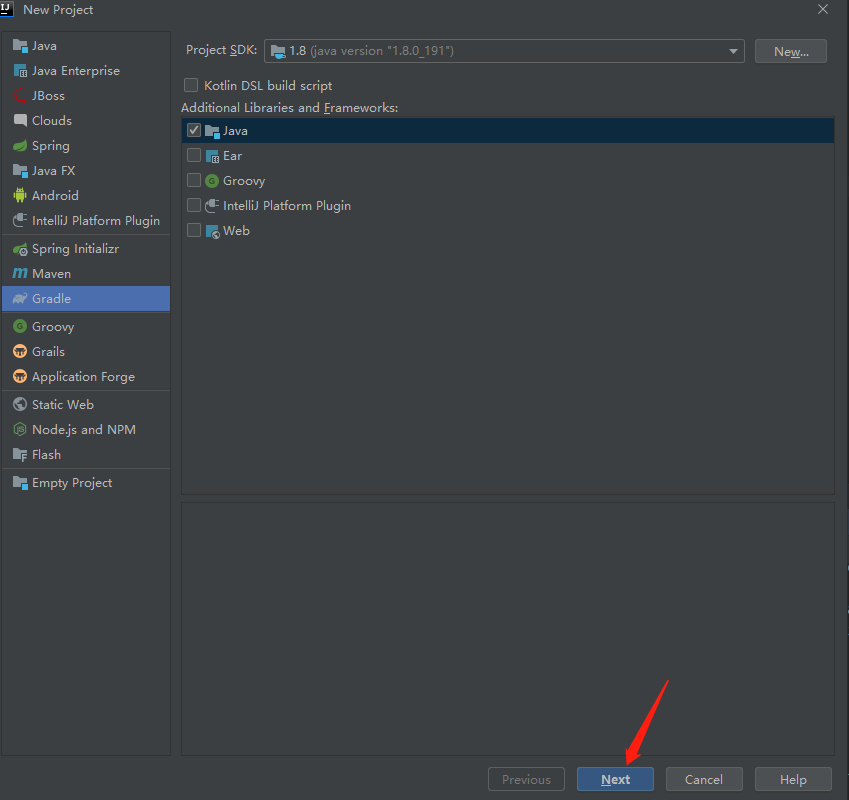
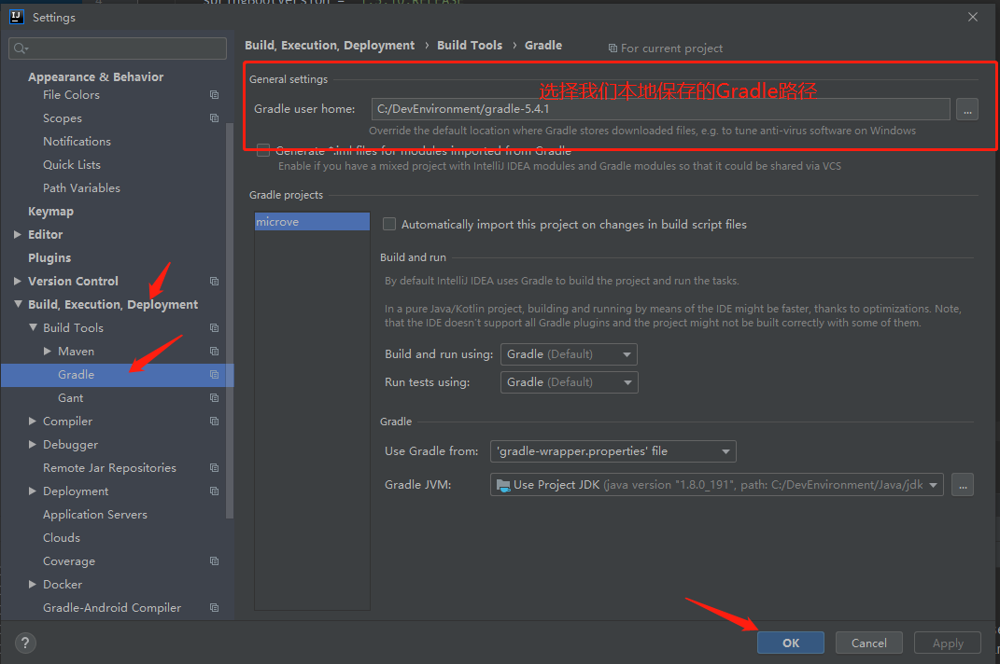
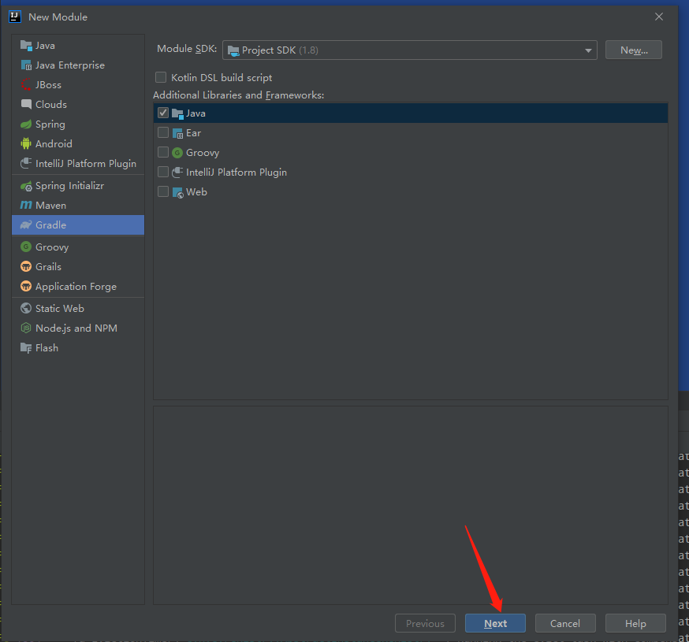
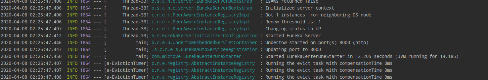
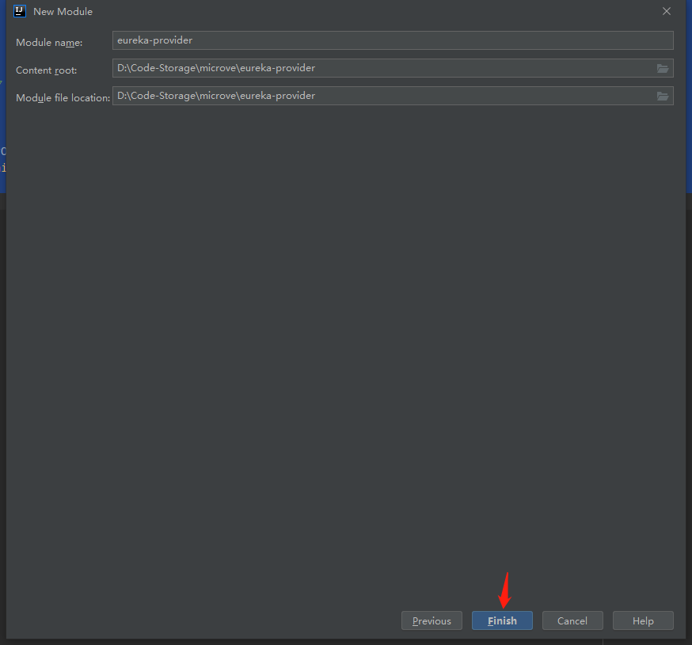
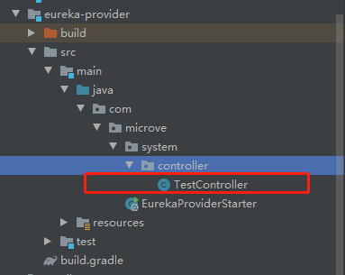
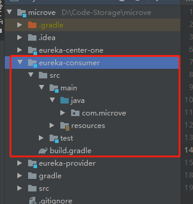

# Eureka从0到1完整实践(上) —— 基于Eureka构建最简服务治理方案

本项目全程使用Gradle完成构建，Gradle版本为5.4.1

## 参考链接
- 详细的Eureka使用指南（基于Maven）：[学习SpringCloud Eureka带你从0到1](https://juejin.im/post/5dc80a8d6fb9a04ac07ce52f#heading-14) —— @鲁毅
- 详细的SpringCloud学习路线：[外行人都能看懂的SpringCloud，错过了血亏！](https://juejin.im/post/5b83466b6fb9a019b421cecc#heading-12) —— @Java3y
- 详细的Gradle项目build.gradle文件配置指南：[SpringCloud-1创建gradle项目，配置eureka注册中心](https://blog.csdn.net/weixin_38970805/article/details/82463122) —— @你的小马哥

在此，我想感谢以上作者带给我的启发，并向各位表达最深的敬意！

**本篇文章，将记录一个最简单点Eureka模型的搭建步骤。**


## 服务治理的意义

试想，当我们面临多个服务之间需要互相调用时，最简单的方式就是使用类似于HttpClient或OKHttp等常见的Http/Https请求框架来进行调用。在服务url信息发生改变时，为了尽可能花费较小代价完成服务的更新，我们需要将它放到配置文件中。这样省去了修改源码 → 编译 → 上传这一流程，只需要修改配置文件中的url信息，重启服务即可。


短时间内看来，我们只需要考虑维护极少的服务配置文件和服务，这样似乎没有太大问题。可随着时间推移，我们面对的业务场景越来越复杂，我们不得不根据不同场景，增加服务、或将一个服务拆分成多个，随之而来的是更为繁杂的维护工作。**这时，有一个线上服务横空出世，它就是注册中心。它可以将我们所有服务的url信息、路由信息等进行统一管理，并提供查询API，在某一服务内部需要调用被统一管理的另一个服务时，只需要通过注册中心，就可以获得所有服务的信息。**从此，我们只需要从注册中心拉取服务列表，就能得到最新、最准确的服务信息。这也是我们常说的——服务治理。

## 初识Eureka——Eureka的两种角色

- Eureka Client

  注册到Eureka Server的服务，可分为服务提供者(Service Provider)和服务消费者(Service Consumer)。

  - Service Provider

    provider将完成三个任务：

    1. 注册：将自身注册到注册中心
    2. 续约：定期向注册中心发送心跳包
    3. 下线：当provider示例关闭时，将发送下线通知到注册中心

  - Service Consumer

    1. 拉取服务列表：向注册中心获取服务信息。
    2. 服务调用：根据服务信息调用服务。

  值得注意的是，一个服务既可以作为服务提供者(Service Provider)将自身示例注册到Eureka Server，同时也可以作为服务消费者(Service Consumer)从Eureka Server拉取服务信息，完成服务消费。


- Eureka Server

  为其他服务提供托管能力的服务。它将具备以下能力：

  1. 自我保护：（可配置）默认将15分钟内心跳成功比例低于85%的服务信息进行保存，不再删除服务注册表中的数据（也就是不会注销任何微服务）。当网络故障恢复后，该Eureka Server节点会自动退出自我保护模式，以便其他服务重新连接后能同步数据。
  2. 定期清除：（可配置）默认每隔60秒，将默认90秒未发送心跳的服务从清单中移除。


## 1. 创建Gradle父级容器项目






- build.gradle的文件内容

  ```groovy
  // 在module编译时自动执行
  buildscript {
      ext {
          //定义一个变量，统一规定springboot的版本
          springBootVersion = '1.5.10.RELEASE'
      }
      repositories {
          maven { url 'http://maven.aliyun.com/nexus/content/groups/public/' }
          jcenter()
          mavenCentral()
          //Spring repo
          maven { url "http://repo.spring.io/snapshot" }
          maven { url "http://repo.spring.io/milestone" }
          maven { url "http://repo.spring.io/release" }
          maven { url 'http://repo.spring.io/plugins-snapshot' }
      }
  
      dependencies {//用来打包
          classpath("org.springframework.boot:spring-boot-gradle-plugin:${springBootVersion}")
      }
  }
  
  plugins {
      id 'java'
  }
  
  sourceCompatibility = 1.8
  
  //设定当前所有的项目的配置
  allprojects {
      group 'com.microve'
      version '1.0-SNAPSHOT'
  
      ext {
          springCloudVersion = 'Edgware.SR2'
      }
  
      repositories {
          maven { url 'http://maven.aliyun.com/nexus/content/groups/public/' }
          jcenter()
          mavenCentral()
          //Spring repo
          maven { url "http://repo.spring.io/snapshot" }
          maven { url "http://repo.spring.io/milestone" }
          maven { url "http://repo.spring.io/release" }
          maven { url 'http://repo.spring.io/plugins-snapshot' }
      }
  }
  
  //设定当前模块的子项目中的配置
  subprojects {
      apply plugin: 'java'
      apply plugin: 'idea'
      apply plugin: 'spring-boot'
  
      dependencies {
          //使用springboot-web组件，但是排除tomcat组件
          compile ('org.springframework.boot:spring-boot-starter-web'){
              exclude module:"spring-boot-starter-tomcat"
          }
          //使用undertow作为servlet容器
          compile 'org.springframework.boot:spring-boot-starter-undertow'
          //使用健康检查组件
          compile 'org.springframework.boot:spring-boot-starter-actuator'
          testCompile(
                  group: 'junit', name: 'junit', version: '4.12'
          )
      }
  
      dependencyManagement {
          imports {
              //加上此配置后，如果需要引用springcloud的组件，就不需要再提供版本信息
              mavenBom "org.springframework.cloud:spring-cloud-dependencies:${springCloudVersion}"
          }
      }
  }
  ```

  

## 2.（可选）配置本地Gradle home

如果跳过此步骤，IDEA将自动下载某个版本的Gradle，由于有时下载很慢。我们可以将一个稳定的Gradle预先下载到本地，让项目加载我们下载好的Gradle。




## 3. 构建Eureka-Server




- build.gradle配置：

  除了在父级项目中引入的依赖，还需单独引入作为Eureka-server的相关依赖。

  ```groovy
  dependencies {
      testCompile group: 'junit', name: 'junit', version: '4.12'
      implementation 'org.springframework.cloud:spring-cloud-starter-eureka-server'
  }
  ```

- application.yml配置：

  该项目的resource文件夹为默认配置文件夹，在该文件夹下创建application.yml文件。

  ```
  server:
    port: 8000
  spring:
    application:
      name: eureka-server
  eureka:
    instance:
      # 该服务的主机名称
      hostname: eureka-center-one
      # 服务失效时间，Eureka多长时间没收到服务的心跳操作，就剔除该服务，默认90秒
      lease-expiration-duration-in-seconds: 90
      # 表示eureka client发送心跳给server端的频率
      lease-renewal-interval-in-seconds: 30
    client:
      # 表示不注册
      register-with-eureka: false
      # 表示不拉取
      fetch-registry: false
      # 如果不配置此url，将会启动在默认端口8761
      service-url:
        defaultZone: http://localhost:8000/eureka/
    server:
      # eureka server清理无效节点的时间间隔，默认60000毫秒，即60秒
      eviction-interval-timer-in-ms: 60000
      # 自我保护模式（缺省为打开）
      enable-self-preservation: true
  ```

  关于为什么需要配置defaultZone属性，请参考这篇博客：

  [eureka注册地址与应用端口不一致]: https://blog.csdn.net/a249040113/article/details/81663910

- 创建Starter类

  

  ```
  package com.microve;
  
  import org.springframework.boot.SpringApplication;
  import org.springframework.boot.autoconfigure.SpringBootApplication;
  import org.springframework.cloud.netflix.eureka.server.EnableEurekaServer;
  
  /**
   * @author : Li Junyi
   * @Remark：
   * @Date 2020-04-05 03:37
   */
  @SpringBootApplication
  @EnableEurekaServer
  public class EurekaCenterOneStarter {
      public static void main(String[] args) {
          SpringApplication.run(EurekaCenterOneStarter.class, args);
      }
  }
  ```

- 启动注册中心：

  启动成功，等待请求。

  

## 4. 构建Eureka Client
按照与创建Eureka Server相同的步骤创建Eureka Client子项目。不同的是，该模块需要引入作为Eureka-Client的依赖。

- 创建子项目

  

  

  

  

- build.gradle

  ```
  dependencies {
      testCompile group: 'junit', name: 'junit', version: '4.12'
      implementation 'org.springframework.cloud:spring-cloud-starter-eureka'
  }
  ```

- application.yml

  ```
  server:
    port: 9090
  spring:
    application:
      // 当服务消费者需要调用服务提供者时，即可通过此name进行调用。
      name: eureka-provider
  eureka:
    client:
      # 表示eureka client间隔多久去拉取服务注册信息，默认为30秒，对于api-gateway，如果要迅速获取服务注册状态，可以缩小该值.
      registry-fetch-interval-seconds: 10
      register-with-eureka: true
      fetch-registry: true
      serviceUrl:
        defaultZone: http://localhost:8000/eureka/
  ```

- 创建供服务消费者调用的接口

  

  ```java
  package com.microve.system.controller;
  
  import org.springframework.web.bind.annotation.GetMapping;
  import org.springframework.web.bind.annotation.RequestMapping;
  import org.springframework.web.bind.annotation.RestController;
  
  /**
   * @author : Li Junyi
   * @Remark：
   * @Date 2020-04-05 04:02
   */
  @RestController
  @RequestMapping("/test")
  public class TestController {
      @GetMapping
      public String getResult(){
          return "服务提供者被调用";
      }
  }
  ```

- 创建启动类

  

  ```
  package com.microve;
  
  import org.springframework.boot.SpringApplication;
  import org.springframework.boot.autoconfigure.SpringBootApplication;
  import org.springframework.cloud.netflix.eureka.EnableEurekaClient;
  
  /**
   * @author : Li Junyi
   * @Remark：
   * @Date 2020-04-05 03:58
   */
  @SpringBootApplication
  @EnableEurekaClient
  public class EurekaProviderStarter {
      public static void main(String[] args) {
          SpringApplication.run(EurekaProviderStarter.class, args);
      }
  }
  
  ```

- 启动服务提供者

  启动成功

  

  在Eureka-Server的日志中，可以看到provider注册成功

  

## 5. 构建服务消费者

- 创建子项目

  使用相同步骤创建子项目: eureka-consumer

  

- build.gradle

  ```groovy
  dependencies {
      testCompile group: 'junit', name: 'junit', version: '4.12'
      implementation 'org.springframework.cloud:spring-cloud-starter-eureka'
  }
  ```

- application.yml

  ```
  server:
    port: 9091
  spring:
    application:
      name: eureka-consumer
  eureka:
    client:
      # 表示eureka client间隔多久去拉取服务注册信息，默认为30秒，对于api-gateway，如果要迅速获取服务注册状态，可以缩小该值.
      registry-fetch-interval-seconds: 10
      register-with-eureka: true
      fetch-registry: true
      serviceUrl:
        defaultZone: http://localhost:8000/eureka/
  ```

- 编写接口调用Service Provider

  \

  ```
  package com.microve.system.controller;
  
  import org.springframework.beans.factory.annotation.Autowired;
  import org.springframework.cloud.client.ServiceInstance;
  import org.springframework.cloud.client.loadbalancer.LoadBalancerClient;
  import org.springframework.core.ParameterizedTypeReference;
  import org.springframework.http.HttpMethod;
  import org.springframework.http.ResponseEntity;
  import org.springframework.web.bind.annotation.GetMapping;
  import org.springframework.web.bind.annotation.RequestMapping;
  import org.springframework.web.bind.annotation.RestController;
  import org.springframework.web.client.RestTemplate;
  
  /**
   * @author : Li Junyi
   * @Remark：
   * @Date 2020-04-05 04:20
   */
  @RestController
  @RequestMapping("/consumer")
  public class ConsumerController {
      @Autowired
      private LoadBalancerClient loadBalancerClient;  //ribbon:负载均衡器
  
      @GetMapping
      public String consume(){
          //选择调用的服务的名称
          //ServiceInstance:封装了服务的基本信息，如：ip、端口号等
          ServiceInstance si = loadBalancerClient.choose("eureka-provider");
          //拼接访问服务的url
          StringBuffer sb = new StringBuffer();
  
          // http://localhost:9090/test
          sb.append("http://").append(si.getHost()).append(":").append(si.getPort()).append("/test");
  
          //SpringMVC RestTemplate
          RestTemplate restTemplate = new RestTemplate();
          ParameterizedTypeReference<String> type = new ParameterizedTypeReference<String>() {
          };
  
          //ResponseEntity：封装了返回值信息
          ResponseEntity<String> entity = restTemplate.exchange(sb.toString(), HttpMethod.GET, null, type);
          return entity.getBody();
      }
  }
  ```

- 创建启动类

  

  ```
  package com.microve;
  
  import org.springframework.boot.SpringApplication;
  import org.springframework.boot.autoconfigure.SpringBootApplication;
  import org.springframework.cloud.netflix.eureka.EnableEurekaClient;
  
  /**
   * @author : Li Junyi
   * @Remark：
   * @Date 2020-04-05 04:17
   */
  @SpringBootApplication
  @EnableEurekaClient
  public class EurekaConsumerStarter {
      public static void main(String[] args) {
          SpringApplication.run(EurekaConsumerStarter.class, args);
      }
  }
  ```

- 启动服务消费者，并调用服务消费者的接口

  

  

  成功通过Eureka-Server调用Service-Provider提供的接口。

  

  

## 注意事项

1. 需要先启动注册中心，再启动提供者、消费者。如果提供者、消费者正在运行，重启注册中心可能会报错。因为提供者、消费者在与注册中心建立连接后，会通过RESTFUL的方式发送心跳至注册中心。


## 源码地址
源码已上传github, 如果遇到问题可下载源码查看。

[microve](https://github.com/slowside45/microve)